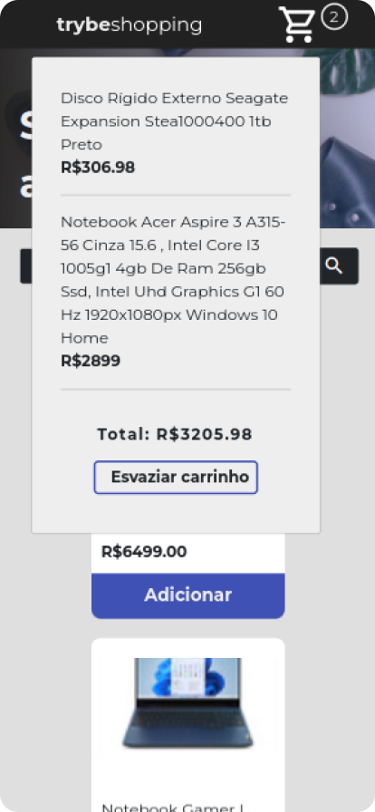

# Welcome to Shopping Cart project!
This is a [Trybe](https://www.betrybe.com/) final project of the Fundamentals Module to exercise and consolidate all the knowledge about HTML, CSS and JavaScript.

---

# Summary
- [Welcome to Shopping Cart project!](#welcome-to-shopping-cart-project!)
- [Note](#note)
- [Summary](#summary)
- [Context](#context)
- [Technologies Used](#technologies-used)
- [Lint](#lint)
- [Preview](#preview)

---

# Note
The following functions were pre-developed by Trybe's team:  __createProductImageElement, createCustomElement, createProductItemElement, getSkuFromProductItem e createCartItemElement.__

---

# Context
This project is a __Shopping Cart Web App__ that consumes [Mercado Livre's API](https://developers.mercadolivre.com.br/pt_br/itens-e-buscas) to display products, calculate the purchase total cost and allows the user to:
 * __Search__ for an specific product
 * __Add__ the product to a cart
 * __Order__ the products by price
 * __Remove__ products or empty the whole cart

---

# Technologies Used
This project used the following technologies and features:
  * __ES6__ | DOM, Local Storage, Destructuring, HOFs, Assyncronous JS, Fetch API
  * __Jest__ | Test Driven Development
  * __HTML5__ | Semantic HTML
  * __CSS3__ | Bootstrap, Mobile First, Responsive Web Design, Flexbox, Media Query

---

# Lint
The project was developed following the Clean Code standards specified by Trybe's Lint rules.

For installation and more information [click here](https://github.com/betrybe/eslint-config-trybe).

---

# Preview
To check and interact with the project [click here](https://ibrahimborba.github.io/projects/shopping-cart/).

| Products List | Order by Price | Shopping Cart | Handling Errors |
| --- | --- | --- | --- |
|  |  |  |  |
